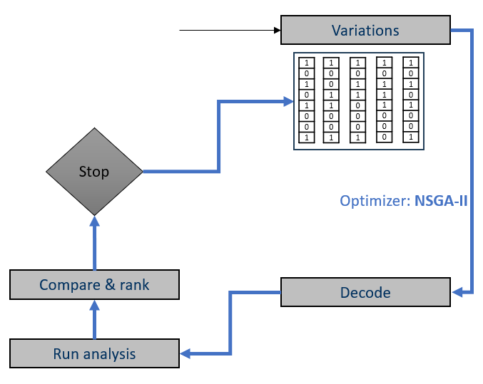
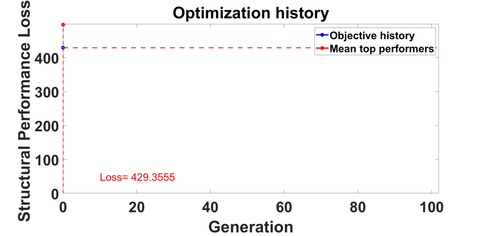

<!-- Display the GIF centered -->

  

# Evolutionary Optimization Framework for Composite Pressure Vessels

## Overview
This repository contains the core algorithmic implementation of an **NSGA-II (Non-dominated Sorting Genetic Algorithm)** used to optimize Type-IV composite pressure vessels (COPVs). 

Developed at **TU Dresden**, this framework automates the interaction between the optimization engine and the Finite Element solver (**Abaqus**), enabling the generative design of complex composite layups. 

  

## Key Features
*   **Custom Genetic Operators:** Implementation of Double Point Crossover (`DoublePointCrossover.m`) and Polynomial Mutation from scratch, specifically designed for discrete composite layup vectors.
*   **Process Automation:** Robust process handling (`killAllAbaqusProcesses.m`) to manage commercial solver licenses and clean up stuck jobs on Linux clusters/HPC.
*   **Parametric Generation:** Automated generation of Abaqus Input Files (`writeINP.m`) based on gene sequences.
*   **Resilience:** Self-healing restart capability (`restarterScript.m`) to recover from power failures or solver crashes during week-long runs.

## Technology Stack
*   **Core Logic:** MATLAB (Research Prototype).
*   **Simulation:** Abaqus Standard/Explicit.
*   **HPC Integration:** Custom shell scripting for job distribution.

## Context
*This codebase represents the research prototype used for the validation of combinatorial optimization strategies. Modern implementations of this logic for production environments are currently being migrated to **Python** using `pymoo` and `scikit-learn` for improved integration with CI/CD pipelines.*

## File Structure Highlights
*   `main_script.m`: The central orchestrator of the optimization loop.
*   `run_generation.m`: Manages the parallel execution of the population.
*   `getObjectiveVal.m`: Extracts structural results (Stress/Burst Pressure) from ODB files.

## Sample Optimization history with a custom objective (Minimize shear stress concentraion + Minimize reinfocement maaterial usage + Maximize material safety factor )

  

